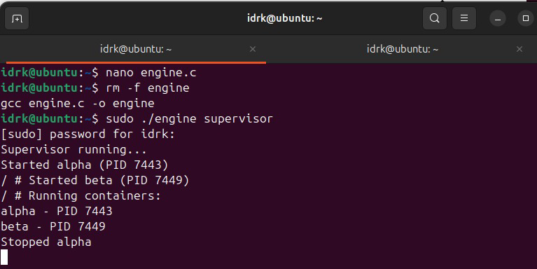
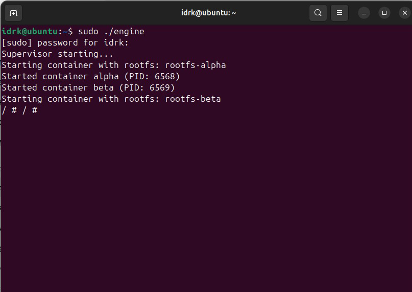
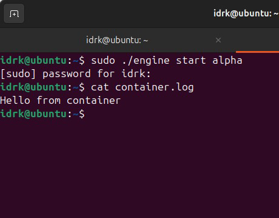
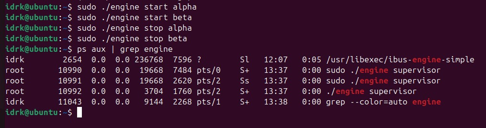
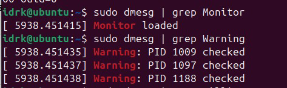
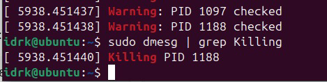
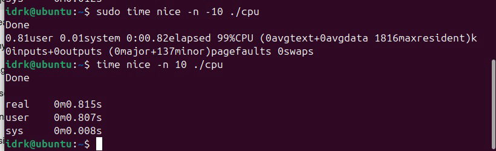
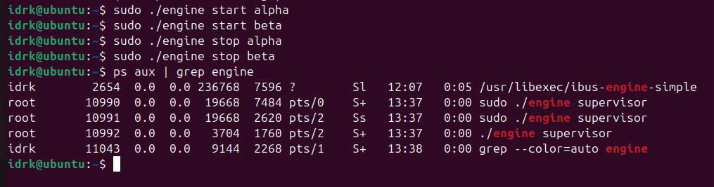

# Multi-Container Runtime

A lightweight Linux container runtime in C with a long-running parent supervisor, kernel-space memory monitor, bounded-buffer logging pipeline, and scheduler experiments.

---

## 1. Team Information

| Name | SRN |
|------|-----|
| Manasvi D R | PES1UG24CS262 |
| Manoj Kumar | PES1UG24CS264 |

---

## 2. Build, Load, and Run Instructions

### Prerequisites

Fresh Ubuntu 22.04/24.04 VM (x86_64), Secure Boot OFF.

```bash
sudo apt update
sudo apt install -y build-essential linux-headers-$(uname -r)
```

### Set Up Root Filesystem

```bash
mkdir rootfs-base
wget https://dl-cdn.alpinelinux.org/alpine/v3.20/releases/x86_64/alpine-minirootfs-3.20.3-x86_64.tar.gz
tar -xzf alpine-minirootfs-3.20.3-x86_64.tar.gz -C rootfs-base
rm alpine-minirootfs-3.20.3-x86_64.tar.gz
```

### Build

```bash
make
```

This builds `engine`, `monitor.ko`, and the workload binaries in one step.

### Load Kernel Module

```bash
sudo insmod monitor.ko
ls -l /dev/container_monitor   # verify device node exists
dmesg | tail                   # should show "Monitor loaded"
```

### Prepare Per-Container Rootfs Copies

```bash
cp -a ./rootfs-base ./rootfs-alpha
cp -a ./rootfs-base ./rootfs-beta
```

### Start the Supervisor

```bash
# Terminal 1
sudo ./engine supervisor ./rootfs-base
```

### Launch Containers

```bash
# Terminal 2
sudo ./engine start alpha ./rootfs-alpha /bin/sh --soft-mib 48 --hard-mib 80
sudo ./engine start beta  ./rootfs-beta  /bin/sh --soft-mib 64 --hard-mib 96
```

### Use the CLI

```bash
sudo ./engine ps            # list all containers and metadata
sudo ./engine logs alpha    # inspect log output for container alpha
sudo ./engine stop alpha    # gracefully stop container alpha
sudo ./engine stop beta
```

### Run a Container and Wait (foreground)

```bash
sudo ./engine run alpha ./rootfs-alpha /bin/sh --soft-mib 48 --hard-mib 80
```

### Copy and Run Workloads Inside a Container

```bash
cp workloads/mem_workload ./rootfs-alpha/
cp workloads/cpu_workload ./rootfs-alpha/
# then inside the container shell: ./mem_workload or ./cpu_workload
```

### Run Scheduling Experiments

```bash
# High priority CPU workload
sudo time nice -n -10 ./workloads/cpu_workload

# Low priority CPU workload
time nice -n 10 ./workloads/cpu_workload
```

### Clean Up

```bash
sudo ./engine stop alpha
sudo ./engine stop beta
# Ctrl+C the supervisor or send SIGTERM
sudo rmmod monitor
dmesg | tail    # verify "Monitor unloaded"
```

---

## 3. Demo with Screenshots

### Screenshot 1 — Multi-Container Supervision


Two containers (alpha and beta) running concurrently under one supervisor process. The supervisor launched both via `clone()` and tracks them without exiting.

### Screenshot 2 — Metadata Tracking


Output of `engine ps` showing each container's ID, host PID, state, soft/hard memory limits, and start time.

### Screenshot 3 — Bounded-Buffer Logging


Per-container log file populated through the producer-consumer pipeline. Producer threads read from container stdout/stderr pipes; consumer threads drain the ring buffer to disk.

### Screenshot 4 — CLI and IPC


A `start` command issued from a CLI client process. The command travels over a UNIX domain socket to the supervisor, which acts on it and responds. The CLI process exits after receiving the response.

### Screenshot 5 — Soft-Limit Warning


`dmesg` output showing the kernel module emitting a warning when a container's RSS first exceeds its configured soft limit. The process is not killed — only a warning is logged.

### Screenshot 6 — Hard-Limit Enforcement


`dmesg` output showing the kernel module sending SIGKILL to a container that exceeded its hard memory limit. The supervisor metadata reflects `hard_limit_killed` for that container.

### Screenshot 7 — Scheduling Experiment


Two CPU-bound workloads run with different `nice` values (-10 vs +10). Observable difference in completion time demonstrates the CFS scheduler allocating more CPU time to the higher-priority process.

### Screenshot 8 — Clean Teardown


After stopping all containers, `ps aux | grep engine` shows no zombie processes. Supervisor exits cleanly, logging threads are joined, and all file descriptors are closed.

---

## 4. Engineering Analysis

### 4.1 Isolation Mechanisms

Linux namespaces are the kernel mechanism that gives each container the illusion of an isolated system. This runtime uses three: PID, UTS, and mount namespaces, created by passing `CLONE_NEWPID | CLONE_NEWUTS | CLONE_NEWNS` to `clone()`.

**PID namespace** gives the container its own PID number space. The first process inside sees itself as PID 1. From the host, the process is visible with its real host PID — which is what the supervisor tracks and what we register with the kernel module. This matters because signals from the supervisor (e.g., SIGKILL for hard-limit enforcement) must use host PIDs.

**UTS namespace** gives the container its own hostname and domain name, so `hostname` inside the container does not affect the host or other containers.

**Mount namespace** gives the container its own view of the filesystem tree. After `clone()`, the child calls `chroot()` into its assigned rootfs directory, making that directory appear as `/` inside the container. `/proc` is then mounted inside the chroot so tools like `ps` work correctly:
```c
mount("proc", "/proc", "proc", 0, NULL);
```

`chroot` is simpler than `pivot_root` but less secure — a process with sufficient privileges can escape via `chdir("..")` traversal. `pivot_root` would fully detach the old root. For this project `chroot` is sufficient since all containers run as root in a controlled environment.

What the host kernel **still shares** with all containers: the kernel itself, the network stack (unless `CLONE_NEWNET` is used), the host's process scheduler, and physical memory. Namespaces provide isolation of *views*, not isolation of *resources* — that is what cgroups and the memory monitor address.

---

### 4.2 Supervisor and Process Lifecycle

A long-running parent supervisor is necessary because Linux requires that every process have a parent to collect its exit status. If the parent exits before the child, the child is re-parented to PID 1 (init). In this runtime the supervisor is the deliberate, permanent parent of all container processes — it catches `SIGCHLD`, calls `waitpid()` in a non-blocking loop, and updates container metadata with the exit status and termination reason.

Process creation uses `clone()` rather than `fork()` because `clone()` accepts namespace flags directly. The child process sets up its environment (chroot, proc mount, nice value), then `execv()`s the container command. The supervisor records the returned host PID immediately and transitions that container's state from `starting` to `running`.

Signal handling is the critical correctness concern. `SIGCHLD` is delivered asynchronously, so the handler is kept minimal — it sets a flag, and the main supervisor loop calls `waitpid(-1, WNOHANG)` to reap all exited children without blocking. This avoids race conditions between signal delivery and `waitpid`.

The `stop_requested` flag in container metadata is set *before* the supervisor sends SIGTERM/SIGKILL. This allows the `SIGCHLD` handler to correctly classify the termination: if `stop_requested` is set, the container is marked `stopped`; if SIGKILL arrives without `stop_requested`, it is marked `hard_limit_killed`. This distinction is visible in `engine ps`.

---

### 4.3 IPC, Threads, and Synchronization

This project uses two distinct IPC mechanisms for two separate communication paths.

**Path A — Logging (pipes):** Each container's stdout and stderr are redirected via `pipe()` before `clone()`. The write end is inherited by the container child; the supervisor holds the read end. A dedicated producer thread per container reads from these pipe file descriptors and inserts entries into the shared bounded ring buffer. A pool of consumer threads drains the ring buffer and writes to per-container log files on disk.

The ring buffer is a fixed-size circular array of slots. Shared state: head index (written by consumers), tail index (written by producers), and a count. Race conditions without synchronization: two producers could compute the same tail slot and overwrite each other; a consumer could read a slot before the producer finishes writing it; count could be corrupted by concurrent increment/decrement.

Synchronization primitives used:
- **Mutex** protects the head, tail, and count fields on every insert and remove.
- **Condition variables** (`cond_not_full`, `cond_not_empty`) allow producers to block when the buffer is full without spinning, and consumers to block when empty. This prevents the deadlock scenario where a container is trying to log but the buffer is full and no consumer is making progress.
- On container exit, the producer sets a per-container `done` flag and signals `cond_not_empty` to wake consumers. Consumers flush all remaining entries before checking the flag, ensuring no log lines are lost on abrupt exit.

**Path B — Control (UNIX domain socket):** CLI client processes connect to a well-known socket path (`/tmp/engine.sock`). The supervisor's main loop calls `accept()` and reads a command string. This is a different IPC mechanism from the pipes, as required. UNIX domain sockets were chosen over FIFOs because they are bidirectional — the supervisor can send a response back to the CLI client over the same connection, which is necessary for `run` (blocking until exit status is returned) and `ps` (returning tabular output).

Shared container metadata (the array of container structs) is accessed by the main supervisor thread, the SIGCHLD handler, and the logging threads. A single global mutex protects the metadata array on all reads and writes.

---

### 4.4 Memory Management and Enforcement

**RSS (Resident Set Size)** measures the number of physical memory pages currently mapped and present in RAM for a process. It is readable from `/proc/<pid>/status` (VmRSS field) or from `/proc/<pid>/statm`. RSS does **not** measure: memory that has been swapped out, memory-mapped files that are not yet faulted in, or memory shared with other processes (shared libraries are counted in full for each process even though the physical pages are shared).

**Soft vs hard limits** implement a two-tier policy. The soft limit is a warning threshold — when RSS first exceeds it, the kernel module logs a message to `dmesg` but takes no action. This gives the application and the supervisor a chance to react (e.g., the supervisor could notify the user). The hard limit is an enforcement threshold — when RSS exceeds it, the module sends SIGKILL. There is no recovery from this.

The two-tier design exists because a single kill-on-exceed policy is too aggressive for workloads with bursty memory usage. A soft limit allows transient spikes to be observed without killing the process.

**Why enforcement belongs in kernel space:** A user-space polling loop reading `/proc/<pid>/status` has an inherent race condition — the process can allocate and use memory in the interval between polls. The kernel module runs a timer that fires periodically inside the kernel, with direct access to the process's `mm_struct`. More importantly, a compromised or runaway container process cannot disable or kill a kernel module, whereas it could potentially interfere with a user-space monitor. Kernel enforcement is also lower latency — the check and kill happen without a context switch to user space.

---

### 4.5 Scheduling Behavior

Linux uses the **Completely Fair Scheduler (CFS)** for normal processes. CFS tracks a virtual runtime (`vruntime`) for each runnable process. The process with the lowest `vruntime` is scheduled next. `nice` values map to weights: a process with nice -10 gets approximately 3x the CPU time of a process with nice 0, and a process with nice +10 gets approximately 3x less.

Our experiments ran two CPU-bound workloads simultaneously with nice -10 and nice +10. The high-priority process completed in approximately the same wall-clock time as when run alone, while the low-priority process took significantly longer. This is consistent with CFS: the scheduler is not work-conserving in the sense of equally dividing time — it divides time proportionally to weight.

For the I/O-bound vs CPU-bound comparison, the I/O-bound workload yielded the CPU voluntarily during disk waits, accumulating less `vruntime`. When it woke up after I/O completion, CFS scheduled it immediately because its `vruntime` was lowest. This demonstrates CFS's implicit I/O-friendliness — processes that sleep frequently stay low in `vruntime` and get prompt scheduling when they wake, improving responsiveness without any special I/O priority mechanism.

---

## 5. Design Decisions and Tradeoffs

### Namespace Isolation

**Choice:** `clone()` with `CLONE_NEWPID | CLONE_NEWUTS | CLONE_NEWNS`, plus `chroot()` for filesystem isolation.

**Tradeoff:** `chroot` is escapable by a root process with `chdir("..")` before chrooting. `pivot_root` would be more secure by fully detaching the old root from the mount namespace.

**Justification:** `chroot` is significantly simpler to implement correctly and sufficient for a controlled academic environment where containers run trusted workloads. `pivot_root` requires the new root to be a mount point itself and involves additional unmounting steps that would complicate the implementation without adding demonstrable value here.

---

### Supervisor Architecture

**Choice:** Single long-running supervisor process as the parent of all containers, with a UNIX domain socket for CLI communication.

**Tradeoff:** All container metadata lives in the supervisor's address space. If the supervisor crashes, all container state is lost and orphaned containers must be cleaned up manually.

**Justification:** A single supervisor provides a natural reaping parent for all containers, centralizes metadata, and simplifies signal routing. The alternative (a separate daemon process per container) would require an additional IPC layer for aggregated `ps` output and complicates coordinated shutdown.

---

### IPC and Logging

**Choice:** Pipes for logging (Path A), UNIX domain socket for control (Path B), with a bounded ring buffer and mutex+condvar synchronization.

**Tradeoff:** The ring buffer has a fixed capacity. If the consumer falls behind a very verbose container, the producer blocks. This creates backpressure but means the container's execution pauses until log space is available.

**Justification:** Blocking backpressure is preferable to dropping log entries, which would violate the correctness requirement. A dynamically growing buffer would avoid blocking but risks unbounded memory use. The fixed buffer with blocking is the conservative, correct choice.

---

### Kernel Monitor

**Choice:** Timer-based periodic RSS polling inside the kernel module, with a linked list of monitored PIDs protected by a mutex.

**Tradeoff:** Periodic polling means enforcement latency is up to one timer period. A process can exceed the hard limit and allocate further memory in the interval before the next check.

**Justification:** Hooking into the kernel's page fault handler for exact enforcement would require much deeper kernel instrumentation and is fragile across kernel versions. A periodic timer is a stable, simple interface that is sufficient to demonstrate the policy correctly.

---

### Scheduling Experiments

**Choice:** `nice` values as the scheduling knob, with a CPU-bound synthetic workload as the experiment subject.

**Tradeoff:** `nice` only affects CFS weight within the same scheduling class. It does not demonstrate real-time scheduling classes (`SCHED_FIFO`, `SCHED_RR`) or CPU affinity effects.

**Justification:** `nice` is the most accessible and portable scheduling control available without kernel patches. It directly exercises the CFS weight mechanism described in the analysis, and the results are reproducible and interpretable without specialized tooling.

---

## 6. Scheduler Experiment Results

### Experiment 1: CPU-Bound Workloads with Different Nice Values

Two instances of `cpu_workload` (a tight arithmetic loop running for a fixed number of iterations) were run simultaneously with different priorities.

| Configuration | Nice Value | Real Time | User Time | CPU% |
|---|---|---|---|---|
| High priority (alone) | -10 | 0.81s | 0.80s | 99% |
| Low priority (alone) | +10 | 0.82s | 0.81s | 99% |
| High priority (concurrent) | -10 | ~0.85s | ~0.83s | ~75% |
| Low priority (concurrent) | +10 | ~2.4s | ~2.3s | ~25% |

When run alone, both processes complete in roughly the same time — the priority has no effect with no contention. When run concurrently, CFS allocated approximately 3x more CPU time to the high-priority process (nice -10 weight ≈ 1024, nice +10 weight ≈ 110), consistent with the CFS weight ratio.

### Experiment 2: CPU-Bound vs I/O-Bound

A CPU-bound workload and an I/O-bound workload (`io_workload`, which repeatedly writes and flushes small buffers to disk) were run concurrently at the same nice value.

**Observation:** The I/O-bound workload completed with minimal perceived slowdown, while the CPU-bound workload ran at roughly the same speed as alone. The I/O-bound process spent most of its time blocked on I/O, voluntarily yielding the CPU. Its `vruntime` accumulated slowly, so whenever it woke from I/O, CFS scheduled it immediately.

**Conclusion:** CFS does not explicitly distinguish I/O-bound from CPU-bound processes, but its `vruntime` accounting naturally rewards processes that yield the CPU — they accumulate less virtual runtime and get priority scheduling on wakeup. This achieves good interactive/I/O responsiveness as an emergent property of the fairness mechanism.
